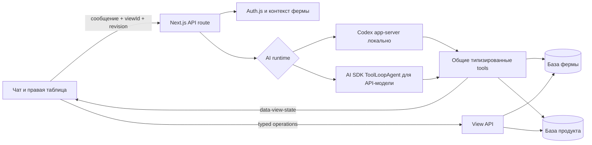

# Интеграция Аркаши с базой фермы и правой панелью

> Рабочий документ. [Навигация и актуальный срез](README.md). Датированные разделы описывают свой этап; ранние планы не подтверждают текущую готовность. Пути в командах указаны от корня репозитория.

Статус: локальный контракт ReportView v6 зафиксирован 04.09.2026; дерево фильтров восстановлено, группировка ограничена одним полем. Точные критерии опубликованы в [формальных требованиях к таблице](TABLE-VIEW-REQUIREMENTS.md).

## Дополнение v6 — исполнение правил CSV

Дерево, строка чипов, один уровень группировки и размеры оболочки сохранены. V1–v5 мигрируют в v6; исходное дерево v5 не упрощается. Исторические разделы о восстановлении v5 ниже описывают предыдущий этап.

- Пределы: 128 условий, глубина 8, 64 колонки; большой список применяется целиком, а не пакетом обрезанных операций.
- Новые значения: точное десятичное число без потери разрядов, сравнение с совместимым полем и дата относительно текущего дня фермы. Редактирование находится в прежнем popover условия.
- Обычное сравнение с отсутствующим значением не даёт совпадения, в том числе под НЕ. Для отсутствия используются отдельные операторы «пусто / не пусто».
- `ruleContext` хранит версию правила, привязку фермы, параметры, время и снимок данных. Ручная правка ставит `modified=true`, сохраняя происхождение.
- Устаревший снимок обновляется через существующий повтор загрузки или `refreshView`; ручные фильтры не заменяются исходным пресетом.

Реальная степень покрытия и незакрытые критерии: [rules/implementation-status.md](../../rules/implementation-status.md).

Связанные документы: [DATABASE.md](DATABASE.md) | [AGENT.md](AGENT.md) | [формальные требования к таблице](TABLE-VIEW-REQUIREMENTS.md) | [исследование UX](FILTER-UX.md) | [ARCHITECTURE.md](ARCHITECTURE.md) | [PLAN.md](PLAN.md).

## Результат

Следующий этап — исполнение определений из `data/lists.csv`: [контракт правил и данных](CSV-RULES.md), [детальный план R00–R21](CSV-RULES-PLAN.md). Статус на 04.09.2026: каталог и tools подключены; полный CSV ещё не покрыт. Каталог загружен в продуктовую БД; tools ищут и применяют его версии, а не передают весь CSV модели. Baseline дерева v5 опубликован отдельно (`2deba93`); полнота исполнения проверяется по каждому определению.

Пользователь ведёт диалог слева и одновременно работает с таблицей животных справа. Ассистент знает текущее сохранённое представление, фактически видимые строки, выделение и раскрытые группы. По команде пользователя агент читает базу фермы, меняет представление таблицы и объясняет результат. Ручные изменения пользователя сразу становятся новым контекстом агента.

Агент не получает произвольный SQL и не управляет DOM. Он вызывает типизированные серверные инструменты. Интерфейс передаёт смысловое состояние таблицы, а агент возвращает проверенную команду изменения этого состояния.

## Границы этапа

Входит:

- подключение `agent-app/` к существующей событийной базе `arka_test`;
- фильтр по одной или нескольким разрешённым пользователю фермам;
- чтение животных, текущих состояний и агрегатов;
- постоянная таблица в правой панели;
- ручное и агентное изменение колонок, фермы как обычного фильтра, дерева фильтров, сортировки и группировки;
- сохранение представления и восстановление после перезагрузки;
- защита от доступа к чужой ферме и перезаписи более новой версии таблицы;
- потоковая передача состояния через AI SDK 7.

Не входит:

- запись новых событий животных и изменение исходных фактов;
- исполнение расписаний CSV и запись событий агентом; каталог и применение правил описаны в [CSV-RULES.md](CSV-RULES.md);
- визуальный редактор произвольных SQL-запросов;
- совместное редактирование одной таблицы несколькими пользователями в реальном времени.

## Архитектура



| Слой | Ответственность |
|---|---|
| React-клиент | Рисует таблицу; держит локальный черновик одного условия, показывает дерево чипами с операторами и отправляет типизированные операции через View API |
| Chat transport | Передаёт `viewId`, `revision`, выделение, `viewportRowIds` и `expandedGroupPaths` |
| Next.js API route | Проверяет сессию, загружает сохранённое представление и выбирает runtime модели |
| Codex app-server | Локально использует сессию ChatGPT и вызывает те же динамические tools |
| `ToolLoopAgent` | При API-провайдере выполняет потоковый цикл зарегистрированных tools |
| Сервис представлений | Хранит состояние таблицы и атомарно увеличивает `revision` |
| Адаптер базы фермы | Строит параметризованные запросы, серверные группы и подписанные keyset-курсоры |
| База фермы | Остаётся источником фактов о фермах, животных и событиях |
| База продукта | Хранит чаты и сохранённые представления правой панели |

## Два соединения с PostgreSQL

`agent-app/` использует независимые строки подключения:

| Переменная | База | Назначение |
|---|---|---|
| `POSTGRES_URL` | продуктовая | пользователи, чаты, сообщения, файлы, представления |
| `FARM_DATABASE_URL` | фермерская | фермы, животные, события, текущие состояния |

Локально обе базы могут работать в одном PostgreSQL-кластере. В production они могут находиться у разных провайдеров. Межбазовые внешние ключи не используются: связь проходит через UUID фермы и пользователя.

Сервер открывает соединение с базой фермы под ролью чтения. Перед каждым запросом он устанавливает разрешённый список `farm_id`; существующая RLS-политика остаётся последней линией защиты.

## Контекст пользователя и фермы

Источник личности — серверная сессия Auth.js. `userId` и список разрешённых ферм никогда не принимаются от модели.

Связь пользователя с фермами хранится в существующем `farm_access`: в production `subject_id` равен UUID пользователя продукта. Локальный demo-subject может иметь доступ к шести фермам, но `FARM_ACTIVE_ID` дополнительно ограничивает запросы выбранной фермой. Удаление условия `farmId` из пользовательских фильтров не снимает серверное ограничение. `configureAnimalTable` не принимает произвольный farmId от модели.

Tools получают минимальный закрытый контекст:

```ts
type FarmToolContext = {
  userId: string;
  dataStream: UIMessageStreamWriter<ChatMessage>;
};
```

`userId` замыкается в серверных реализациях tools. Условие по ферме читается из принадлежащего пользователю `ReportView`, затем пересекается с `farm_access`. Модель не получает секреты, строку подключения или права на выбор чужой фермы.

## Сохранённое представление

В продуктовой Drizzle-схеме хранится таблица `ReportView`:

| Поле | Назначение |
|---|---|
| `id` | UUID представления |
| `userId` | владелец |
| `chatId` | чат, в котором открыто представление |
| `entityType` | на первом этапе только `animal` |
| `farmId` | внутреннее legacy/bootstrap-поле; не входит в v5 state и не ограничивает выборку |
| `columns` | упорядоченный массив колонок |
| `schemaVersion` | версия контракта; текущая — `6` |
| `filters` | типизированное дерево групп **И / ИЛИ / НЕ**; каждый узел имеет стабильный ID |
| `sort` | до пяти правил со стабильными ID и порядком |
| `groupBy` | пустой массив или одно правило со стабильным ID |
| `revision` | целое число, увеличивается при каждом изменении |
| `createdAt`, `updatedAt` | технические даты |

Название хранится у чата; отдельного названия отчёта нет. Прежний `farmId` используется только для создания начального условия **Ферма** и миграции старых записей. Источник выборки в v5 — `filters ∩ farm_access`.

Выделение строк и положение прокрутки являются краткоживущим состоянием браузера. Колонка выбора строк пока скрыта; инфраструктура выделения не влияет на сохранённый отчёт.

### Контракты состояния

```ts
type ReportViewState = {
  id: string;
  chatId: string;
  revision: number;
  schemaVersion: 6;
  entityType: "animal";
  columns: string[];
  filters: FilterGroup;
  sort: SortRule[];
  groupBy: [] | [GroupRule];
};

type ViewContext = {
  viewId: string;
  revision: number;
  selectedIds: string[];
  viewportRowIds: string[];
  expandedGroupPaths: GroupPath[];
};
```

`viewportRowIds` вычисляется по фактическому пересечению отрисованных строк виртуальной таблицы с её видимой областью. Полный загруженный результат модели не отправляется; остальные строки агент запрашивает инструментом с пагинацией. `expandedGroupPaths` содержит только раскрытые серверные пути групп.

Фильтры являются деревом условий и групп:

```ts
type FilterCondition = {
  id: string;
  kind: "condition";
  negated: boolean;
  field: string;
  operator: FilterOperator;
  value?: FilterValue;
};

type FilterGroup = {
  id: string;
  kind: "group";
  combinator: "and" | "or";
  negated: boolean;
  children: Array<FilterCondition | FilterGroup>;
};
```

`FilterValue` — различимый union: скаляр `string | number | decimal | boolean | date`, список скаляров, диапазон, относительная дата или ссылка на совместимое поле. Группы соединяют дочерние узлы через **И** или **ИЛИ**, `negated` задаёт **НЕ** для условия или группы. Сервер валидирует всё дерево до сохранения и построения SQL; максимум — 128 условий и 8 уровней.

## Каталог полей

Запросы строятся не из названий SQL-колонок, предложенных моделью, а из серверного каталога полей.

```ts
type FieldDefinition = {
  id: string;
  label: string;
  type: "text" | "number" | "date" | "boolean";
  editor: "text" | "number" | "date" | "boolean" | "select";
  valueSource: "freeform" | "boolean" | "distinct";
  operators: FilterOperator[];
  sortable: boolean;
  groupable: boolean;
  unit?: string;
};
```

Каталог читает индексированную проекцию `animal_state_query`, полностью пересчитываемую из событий. Доступны идентификатор, кличка, пол, возраст, группа, статус, лактация, воспроизводство, последние надой и вес, активные диагнозы, протоколы, ограничения, архивирование и выбытие.

Разрешённые операторы: `eq`, `neq`, `in`, `not_in`, `gt`, `gte`, `lt`, `lte`, `between`, `contains`, `not_contains`, `starts_with`, `ends_with`, `today`, `in_last`, `in_next`, `is_empty`, `is_not_empty`. Для каждого поля доступно только совместимое подмножество.

Редактор выбирается по типу поля и оператору: справочные значения загружаются отдельным endpoint, диапазоны имеют две типизированные границы, относительные даты — число и единицу. При сохранении сервер отклоняет неизвестные поля, несовместимый оператор, неверную форму значения, невозможную дату и произвольные SQL-фрагменты.

## Инструменты агента

| Tool | Вход | Результат |
|---|---|---|
| `getFarmContext` | без аргументов | доступные пользователю фермы с часовым поясом и ролью |
| `getViewState` | `viewId` | проверенное текущее представление |
| `queryAnimals` | `viewId`, `cursor`, `groupPath`, `limit` | страница серверных групп или строк с `nextCursor`, `snapshot` и глобальными count |
| `summarizeAnimals` | `viewId` | количество, число стельных, средний надой и вес |
| `updateView` | `viewId`, `expectedRevision`, `operations` | новое состояние или конфликт версии |
| `openAnimal` | `animalId`, `viewId` | карточка животного из доступной пользователю фермы; владение view проверено |

`queryAnimals` и `summarizeAnimals` читают базу. `updateView` меняет только сохранённое представление, а не фермерские факты. Для этого этапа инструментов записи в `animal_event` нет.

Каждый tool получает серверный `userId`; условия `field = farmId` читаются из проверенного списка `filters` и пересекаются со списком доступов. Аргументы проходят Zod-проверку до выполнения.

Ручной интерфейс и агент используют один массив `ViewOperation`: `view.update`; `filter.add/update/remove/move/replace`; `sort.add/update/remove/move`; `group.add/update/remove`. Операции фильтров адресуют узел и его родительскую группу по стабильным ID; `filter.replace` атомарно заменяет корень формулы. `group.add` принимает только `index: 0`; чтобы заменить активную группировку, агент обновляет её или сначала удаляет. До 50 операций применяются к копии текущего состояния и валидируются целиком; ошибка в любой операции отменяет весь пакет. Отдельного интерфейса расширенного фильтра нет.

Локальный режим `AI_RUNTIME=codex-app-server` использует текущую сессию ChatGPT и передаёт функции фермы как dynamic tools. Облачный режим использует `ToolLoopAgent` AI SDK и требует API-модель с tool calling. Модель без tool calling сможет вести обычный чат, но не сможет надёжно читать базу и управлять таблицей; текстовый JSON не считается заменой tools.

## Протокол интерфейса

### Интерфейс сообщает агенту текущее состояние

`useChat` использует `DefaultChatTransport`. `prepareSendMessagesRequest` добавляет к запросу:

```json
{
  "viewContext": {
    "viewId": "...",
    "revision": 17,
    "selectedIds": ["..."],
    "viewportRowIds": ["..."],
    "expandedGroupPaths": [
      [{ "field": "statusCode", "value": "LACTATING" }]
    ]
  }
}
```

Сервер загружает канонический `ReportView` по `viewId` и проверяет владельца. Черновик фильтра не передаётся агенту до валидного сохранения; условие по ферме проходит тот же типизированный API, что и остальные фильтры, а сервер ограничивает его через `farm_access`. В модель попадает каноническое состояние v6 вместе с точным viewport и раскрытыми путями.

### Агент сообщает интерфейсу новое состояние

После `updateView` сервер пишет постоянную data part:

```json
{
  "type": "data-view-state",
  "id": "view:<uuid>",
  "data": {
    "id": "...",
    "chatId": "...",
    "entityType": "animal",
    "revision": 18,
    "schemaVersion": 6,
    "filters": {
      "id": "...",
      "kind": "group",
      "combinator": "and",
      "negated": false,
      "children": []
    },
    "columns": ["primaryIdentifier", "name", "statusCode"],
    "sort": [],
    "groupBy": []
  }
}
```

`DataStreamHandler` применяет часть к `useWorkspacePreview`. Правая панель открывает режим `table`, перезапрашивает страницу данных и показывает новое состояние. Одинаковый `id` позволяет обновлять одну data part во время потока без создания дубликатов.

Тип `ChatMessage` связывает схемы tools через `InferUITool`, серверный stream и React-компоненты; расхождения ловит TypeScript.

## Поведение правой панели

Над таблицей находятся четыре действия: **Фильтр**, **Сортировка**, **Группировка**, **Колонки**. **Фильтр** только показывает или скрывает вторую строку. В ней находятся только одинаково оформленные чипы активных фильтров и **Добавить фильтр**; чип фермы не заменяет серверную область доступа. Каждый чип задаёт `атрибут → оператор → значение`, а формула объединяет условия и вложенные группы через **И / ИЛИ / НЕ**. Вложенность показывается теми же чипами, операторами и скобками; отдельного расширенного режима нет.

Режим `table` содержит:

- настройку колонок без отдельного заголовка отчёта и селектора активной фермы;
- типизированные редакторы текста, справочников, чисел, дат, диапазонов и относительных дат;
- до пяти упорядоченных правил сортировки и не более одного поля группировки;
- серверные узлы групп с глобальным `count` и отдельной пагинацией каждого `groupPath`;
- автоматическую загрузку следующих keyset-страниц и ручной повтор после ошибки;
- число найденных животных и виртуализированную таблицу на `react-data-grid`;
- состояния загрузки, пустого результата, ошибки и конфликта версии;
- точный расчёт видимого viewport; колонка выделения строк пока скрыта;
- открытие карточки животного без потери текущего отчёта.

Номер животного является первой закреплённой колонкой и основной ссылкой строки. Hover ячейки показывает кнопку карточки справа; у кнопки есть собственное hover/focus-состояние. Hover текста подчёркивает только номер. И текст, и кнопка независимо открывают одну немодальную панель справа внутри таблицы, ниже фильтров и выше нижнего бара, без блокировки интерфейса; кличка не дублирует это действие.

Агентное и ручное изменения проходят через один сервис типизированных операций, одну проверку доступа и один счётчик `revision`. Успешное содержательное изменение возвращает новую версию, которую получают таблица и следующее сообщение в чат.

### Каркас приложения

Чат занимает высоту до верхнего края. В его верхней строке находится только редактируемое название чата; бренд **Аркаша**, приватность и управление доступом не показываются. В боковом меню нет отдельной иконки-ссылки на `/` и массового удаления всех чатов. Строки истории используют компоненты дизайн-системы с различимыми `default`, `hover`, `focus-visible` и `active` состояниями.

Боковое меню и граница чат/просмотр изменяют ширину независимо. Все структурные линии используют один `--divider-color` и толщину `1 px`; соседние панели не дублируют границу. Видимый resize-разделитель сохраняет тот же цвет в покое, hover, focus и после drag, а зона захвата остаётся невидимо расширенной. Верхние панели имеют высоту `46 px`, сложенное боковое меню — ширину `46 px`, кнопки в нём центрированы. Отдельная кнопка сворачивает меню без навигации или перезагрузки.

## Конфликт изменений

`updateView` выполняет условное обновление:

```sql
UPDATE "ReportView"
SET ..., revision = revision + 1
WHERE id = :view_id
  AND "userId" = :user_id
  AND revision = :expected_revision;
```

Если обновлена не одна строка, сервер возвращает `VIEW_REVISION_CONFLICT` и актуальный `ViewState`. Браузер сравнивает затронутую операциями часть базовой и актуальной версии. Если эта часть не менялась, он один раз повторяет тот же пакет с новой `revision`; второго повтора нет. Для `view.update` сравниваются только изменяемые поля, для фильтра — конкретное условие, для сортировки и группировки — соответствующий список. Любое пересечение правок показывается как явный конфликт.

Агентный tool автоматически не перебазирует конфликтный пакет: агент снова читает `getViewState` и формирует новое намерение относительно актуальной версии.

## Безопасность и ограничения запросов

- Авторизация и `farm_access` проверяются на каждом API и tool-вызове.
- Все запросы ограничены множеством ферм из `farm_access`; фильтр **Ферма** может только сузить это множество.
- Поля, операторы и агрегаты выбираются только из каталога.
- Значения передаются параметрами Drizzle/Postgres; текст модели не вставляется в SQL.
- Одна страница содержит не более 200 строк; значение по умолчанию — 50.
- Строки и группы листаются keyset-курсором; offset-пагинация не используется.
- HMAC-подписанный курсор связан с `viewId`, `revision`, разрешённым набором `farmIds`, фильтрами, колонками, сортировкой, `groupPath`, уровнем группы и снимком проекции.
- `animal_state_query_snapshot` увеличивает версию после изменения проекции; старый или подменённый курсор отклоняется.
- Tool-result содержит не более одной страницы и краткую сводку.
- Серверный запрос получает тайм-аут 5 секунд.
- В AI SDK telemetry отключена запись inputs и outputs; изображения, документы и строки tools не попадают в её атрибуты.
- Ошибка БД показывается пользователю без строки подключения и внутреннего SQL.

## Последовательность основного сценария

1. Пользователь открывает чат; приложение восстанавливает связанный `ReportView`.
2. Пользователь вручную ставит фильтр «стельные»; View API сохраняет `revision = 17`.
3. Пользователь пишет: «Оставь первотёлок и добавь надой за 7 дней».
4. Transport отправляет сообщение, `viewId`, `revision`, выделение, точные `viewportRowIds` и `expandedGroupPaths`.
5. Сервер восстанавливает личность и разрешённое множество ферм.
6. Агент вызывает `getViewState`, затем `updateView` с `expectedRevision = 17` и типизированным массивом операций.
7. Сервис атомарно добавляет фильтр лактации, колонку надоя и сохраняет `revision = 18`.
8. Stream передаёт `data-view-state`; таблица обновляет настройки и данные.
9. Агент вызывает `summarizeAnimals` по тем же фильтрам и сообщает число животных.
10. Перезагрузка страницы восстанавливает тот же отчёт версии 18.

## Наблюдаемость

В production telemetry включена для ветки `ToolLoopAgent`; локальная ветка Codex app-server её не пишет. Для обоих runtime перед внешним запуском нужны единые технические метрики tools: название, длительность, число строк, `viewId`, версии и код результата без содержимого сообщений и строк таблицы.

Метрики первого этапа:

- доля успешных запросов к базе;
- p50/p95 времени `queryAnimals`;
- число конфликтов `revision`;
- число отклонённых запросов к чужой ферме;
- число tool-вызовов на сообщение;
- время от команды пользователя до обновления таблицы.

## Реализованный контур

| Этап | Работа | Наблюдаемый результат |
|---|---|---|
| I1 | Подключение и доступ | Сервер получает разрешённые фермы; чужая ферма возвращает `403` |
| I2 | Каталог и запросы | Разрешённые фильтры строят параметризованные запросы к текущим проекциям |
| I3 | `ReportView` и View API | Представление сохраняется, восстанавливается и защищено `revision` |
| I4 | Агент и tools | Codex app-server локально и `ToolLoopAgent` с API-моделью вызывают один набор tools |
| I5 | Таблица | Правая панель отображает реальные строки, фильтры, колонки и сортировку |
| I8 | Table View v5 | Типизированное дерево снова исполняет `AND`/`OR`/`NOT`, v2 сохраняется без потери смысла, а группировка остаётся ограничена одним полем |
| I6 | Двусторонняя синхронизация | Ручное состояние видит агент; tool-result меняет открытую таблицу |
| I7 | Проверка масштаба | Сквозные сценарии и выборки проверены на целевом объёме данных |

## Критерии готовности

Этап завершён только если одновременно выполнены все условия:

1. Пользователь с одной фермой видит её данные без ручного ввода UUID.
2. Пользователь с несколькими фермами может добавить, изменить или удалить обычный фильтр **Ферма**; без него видны все разрешённые фермы.
3. Таблица восстанавливает колонки, фильтры и сортировку после перезагрузки.
4. Ручной фильтр попадает в следующий запрос агента без пересказа пользователем.
5. Команда в чате изменяет открытую таблицу и увеличивает `revision`.
6. Агент может объяснить число строк и используемые фильтры по фактическому состоянию.
7. Запрос к чужой ферме блокируется на API и RLS.
8. Устаревшая команда не перезаписывает более новую ручную правку.
9. В модель не передаётся полный набор животных и неограниченный SQL.
10. Форматирование, TypeScript, production build и сквозные браузерные тесты проходят.
11. На наборе из 6 ферм по 8–9 тысяч животных p95 фильтрации и первой страницы не превышает 1 секунду локально после прогрева; точная команда и замер сохраняются в отчёте проверки.

## Baseline-проверка 03.09.2026

Это результаты прежней версии до реализации требований Table View v3; они сохранены как исторический baseline и не являются приёмкой версии от 04.09.2026.

| Проверка | Результат |
|---|---|
| Объём | 6 ферм × 8 500 животных = 51 000 |
| Реалистичный профиль | 40,03% дойных; 24,98% тёлок; 11,98% стельных; остальные состояния — 23,01% |
| Прямые SQL count + первая страница | 40 итераций после 5 прогревочных; p50 0,6 мс; p95 0,9 мс |
| База | Детерминизм, ограничения, временные срезы, 10 выборок, RLS и индекс — пройдены |
| Браузерная автоматизация | 29 из 29 на детерминированной mock-модели; проверены чат, файлы, таблица и общий tool-контракт |
| Живой Codex runtime | Ручной smoke: ответ через текущую сессию ChatGPT и вызов `updateView` со сменой фермы наблюдались в локальном чате |
| Код | Форматирование, TypeScript и production build — пройдены |

Команды проверки: `./scripts/db-check.sh`, `./scripts/db-generate-scale.sh 42 6 8500`, `corepack pnpm run farm:benchmark` и браузерные тесты из [CLAUDE.md](../../CLAUDE.md).

Точный итоговый gate Table View v3 от 04.09.2026 зафиксирован в разделе «Приёмка» документа [TABLE-VIEW-REQUIREMENTS.md](TABLE-VIEW-REQUIREMENTS.md).

## Источники API

- [AI SDK: ToolLoopAgent](https://ai-sdk.dev/docs/reference/ai-sdk-core/tool-loop-agent)
- [AI SDK: tools and tool calling](https://ai-sdk.dev/docs/ai-sdk-core/tools-and-tool-calling)
- [AI SDK: runtime and tool context](https://ai-sdk.dev/docs/ai-sdk-core/runtime-and-tool-context)
- [AI SDK: transport](https://ai-sdk.dev/docs/ai-sdk-ui/transport)
- [AI SDK: streaming custom data](https://ai-sdk.dev/docs/ai-sdk-ui/streaming-data)
- [AI SDK: generative user interfaces](https://ai-sdk.dev/docs/ai-sdk-ui/generative-user-interfaces)

Режим полной таблицы, компактный чат и сброс фильтров описаны в [требованиях к таблице](TABLE-VIEW-REQUIREMENTS.md).
