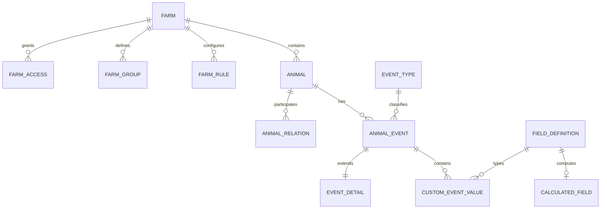

# Исходная событийная база фермы

> Рабочий документ. [Навигация и актуальный срез](README.md). Датированные разделы описывают свой этап; ранние планы не подтверждают текущую готовность. Пути в командах указаны от корня репозитория.

Связанные документы: [ARCHITECTURE.md](ARCHITECTURE.md) | [CLAUDE.md](../../CLAUDE.md) | glossary.md (исходный документ хранится отдельно) | описание выгрузок (исходный документ хранится отдельно).

## Назначение и граница

База хранит исходные данные фермы до появления Аркаши: фермы, животных и факты, происходящие с животными. Она должна позволять восстановить состояние любого животного на выбранную дату и вычислить поля, встречающиеся в рабочих списках заказчика.

В модели остаются три доменных типа объектов:

1. `Farm` — контекст данных, доступа, часового пояса, справочников и правил фермы.
2. `Animal` — карточка конкретного животного.
3. `AnimalEvent` — факт, произошедший с животным в определённое время.

Справочники, связи, таблицы деталей событий и определения вычисляемых полей являются внутренними частями этих объектов, а не новыми самостоятельными доменными сущностями.

В базу не входят Аркаша, чаты, определения списков, расписания списков, результаты запусков и отчёты. Эти системы могут читать исходную базу, но не определяют её модель.

## Что подтверждают материалы заказчика

| Данные в материалах | Решение в модели |
|---|---|
| `company_id` во всех выгрузках | Идентичность компании источника; сопоставление с `farm_id` стенда задаётся отдельно и не заменяет проверку доступа |
| Номер, кличка, пол, порода, родители | Карточка животного и родственные связи |
| Бирка, чип, ошейник, транспондер, Хорриот и внешние ID | История типизированных идентификаторов |
| Группа, статус, госпитальная и дойная группа | Справочники фермы и события изменения состояния |
| Осеменение, стельность, аборт, сухостой, отёл | События воспроизводства |
| Надой, контрольная дойка, жир, белок, соматические клетки | События продуктивности |
| Вес, привес, упитанность, температура | События измерений |
| Болезни, лечение, вакцинация, копытные процедуры | События здоровья и лечения |
| Схемы синхронизации и лечебные протоколы | События назначения и выполнения протоколов |
| Продажа, выбраковка, падёж, архив | События жизненного цикла |
| Заметки, закреплённый техник, страхование | Дополнительные типизированные события |
| Дни после события, интервалы, счётчики, средние и прогнозы | Версионируемый слой вычисляемых полей |
| Пользовательские названия и формулы | Определения полей, псевдонимы и редкие пользовательские события |

Материалы не содержат исходную схему производственной базы, реальные типы колонок, единицы всех показателей, правила доступа и часовые пояса. Эти части ниже являются архитектурным решением, а не восстановленной схемой заказчика.

## Реализация

Базовая схема реализована локально на PostgreSQL 15; в `db/migrations/` находятся 29 миграций, последняя — `029_report_facts.sql`. Первоначальный срез 04.09.2026 содержал 51 000 животных. После доработки демонстрационной фермы — 42 670 записей: 170 на «Лактис Прайм 8» и по 8 500 на остальных пяти фермах. Команда `./scripts/db-check.sh` пересоздаёт тестовую базу и проверяет малый набор из двух ферм и 80 животных, типы событий и десять эталонных выборок. Её нельзя запускать на текущем стенде как обычную проверку без потери большого набора.

Реализация основных типов событий не означает готовность всех полей и правил `lists.csv`. Разделы ниже описывают целевую модель; фактические разрывы и следующий этап зафиксированы в [CSV-RULES.md](CSV-RULES.md), работы — в [CSV-RULES-PLAN.md](CSV-RULES-PLAN.md).

Сгенерированные записи имеют `source_type = SIMULATION`, комментарий `GENERATED TEST DATA` и `metadata.test_data = true`. Они построены ретроспективно из требований этой спецификации и не являются данными заказчика; четыре исходных CSV не импортируются и не изменяются.

Основные точки чтения:

- `effective_animal_events(as_of_at, knowledge_at)` — действующая версия фактов на две временные координаты;
- `animal_state_at(as_of_at, knowledge_at)` — карточка, группа, статус, воспроизводство, продуктивность, здоровье, протоколы и административные состояния;
- `field_value_at(...)` — канонические и пользовательские поля;
- `evaluate_formula_ast(...)` — исполнитель поддержанного набора операций; подключение всех определений из `calculated_field` и согласование грамматики ещё требуют доработки;
- `animal_state_current` и `animal_identifier_current` — полностью пересчитываемые логические проекции;
- `animal_state_query` — индексированная таблица текущего состояния для интерфейса и tools, обновляемая функцией `refresh_animal_state_query()`;
- `animal_state_query_snapshot` — монотонная revision и время изменения проекции; cursor списка связывается с revision и отклоняется после refresh.

RLS ограничивает роль `arka_reader`: для `farm` и `animal_state_query` миграция 012 поддерживает разрешённый набор `arka.farm_ids` с fallback на `arka.farm_id`; исторические таблицы используют ферменный контекст. Параметры устанавливает сервер после проверки `farm_access`, не модель. Новые пути чтения вычисляемых полей должны сохранить изоляцию исходных событий. Триггеры запрещают межферменные ссылки, неверную таблицу деталей, неподходящий тип пользовательского значения, повтор активного идентификатора, несовместимую единицу дозы и изменение подтверждённого события без новой версии.

### Следующий этап: данные для всего каталога CSV

В проверенной БД есть восемь системных определений полей, шесть ферменных `TEMPERAMENT_SCORE` и восемь записей вычислений. `field_value_at` отдельно обрабатывает восемь кодов, а затем читает пользовательские значения; остальные записи формул не становятся исполняемыми автоматически. Seed-определения и `evaluate_formula_ast` используют разные грамматики.

Нужны полный реестр полей из фильтров, колонок и группировок CSV; недостающие факты и справочники; единое исполнение формул; временные области лактаций и протоколов; воспроизводимая история; пакетные проекции и проверки каждого правила. Уже подтверждённые примеры: дни на схеме из списка 541, второе осеменение текущей лактации из 197, дата геномной оценки из 4153, прогноз 305M из 3785.

Если методика внешней оценки в материалах отсутствует, стенд может хранить сгенерированный результат этой оценки как тестовый вход для точного исполнения условия. Это не восстанавливает неизвестную формулу; происхождение значения учитывается отдельно. Исторический план расширения 51 000 животных заменён решением доработать только «Лактис Прайм 8». Номера и история сохранённых животных сохраняются; численность остальных ферм не меняется.

Каталог списков и их выполнения остаётся за пределами этой исходной БД. Новые миграции и заполнение данных начнутся только после отмашки пользователя; текущая команда обновляет документацию.

## Общая архитектура



`animal_event` хранит общий конверт каждого события. Стандартное событие получает ровно одну строку в соответствующей типизированной таблице деталей. Пользовательское событие получает набор типизированных значений, описанных через `field_definition`.

Одна операция создаёт конверт и детали события в одной транзакции. Прикладные роли не имеют права записывать эти таблицы по отдельности.

## Общие соглашения

| Область | Решение |
|---|---|
| СУБД | PostgreSQL |
| Идентификаторы | `UUID` |
| Время | `TIMESTAMPTZ`, хранение в UTC |
| Локальная дата | Вычисляется в IANA-часовом поясе фермы |
| Количества | `NUMERIC`, единица измерения обязательна в определении поля |
| Коды | Неизменяемые машинные значения `UPPER_SNAKE_CASE` |
| Дополнения источника | `metadata JSONB`; обязательные бизнес-поля в JSON не помещаются |
| История | События неизменяемы; исправление создаёт новую версию |
| Изоляция | Каждая рабочая таблица содержит `farm_id` или наследует его через обязательную связь |

У каждого события две временные координаты:

- `occurred_at` — когда факт произошёл на ферме;
- `recorded_at` — когда система получила этот факт.

Это позволяет различать фактическое прошлое и то, что система знала в конкретный момент.

## Объект `Farm`

### `farm`

| Поле | Тип | Назначение |
|---|---|---|
| `id` | UUID | Первичный ключ |
| `external_id` | TEXT | Идентификатор внешней системы |
| `name` | TEXT | Название фермы |
| `timezone` | TEXT | IANA-часовой пояс |
| `status` | TEXT | `ACTIVE`, `INACTIVE`, `ARCHIVED` |
| `settings` | JSONB | Редкие настройки, не содержащие фактов о животных |
| `created_at`, `updated_at` | TIMESTAMPTZ | Технические даты |

### `farm_access`

Хранит доступ внешних пользователей и сервисов без копирования их профилей.

```text
farm_id, subject_id, role, valid_from, valid_to
```

Основные роли: `OWNER`, `MANAGER`, `ZOOTECHNICIAN`, `VET`, `INSEMINATOR`, `READER`, `IMPORT_SERVICE`.

### `farm_group`

```text
id, farm_id, code, name, group_type,
is_hospital, is_milking, is_lactation_group,
valid_from, valid_to
```

Текущая группа животного определяется событием `GROUP_CHANGED`. Таблица задаёт смысл группы, существовавший в соответствующий период.

### Справочники фермы

| Таблица | Содержание |
|---|---|
| `animal_status_type` | Допустимые статусы: тёлка, бык, осеменена, стельная, сухостой, поздний сухостой, не осеменять и другие |
| `disease_definition` | Заболевания и их категории |
| `product_definition` | Препараты, вакцины, единицы дозировки и сроки ограничений |
| `procedure_definition` | Осмотры, исследования и лечебные процедуры |
| `protocol_definition` | Версии лечебных и репродуктивных протоколов |
| `protocol_step_definition` | Порядок, сроки и допустимые результаты шагов протокола |
| `unit_definition` | Допустимые единицы и правила преобразования |

Системные записи справочников имеют `farm_id = NULL`. Ферма может добавлять собственные записи, не меняя системные коды.

### `farm_rule`

Хранит версионируемые правила расчёта ожидаемых дат и нормативов.

```text
id, farm_id, code, value_numeric, unit_code,
valid_from, valid_to, source
```

Минимальные правила: длительность стельности, период сухостоя, цикл охоты, окно проверки стельности, возраст или ДДН первого осеменения.

## Объект `Animal`

### `animal`

Карточка содержит только относительно устойчивые факты.

| Поле | Тип | Назначение |
|---|---|---|
| `id` | UUID | Первичный ключ |
| `farm_id` | UUID | Владелец животного |
| `name` | TEXT | Кличка |
| `sex` | TEXT | `FEMALE`, `MALE`, `UNKNOWN` |
| `breed_code` | TEXT | Порода |
| `birth_date` | DATE | Дата рождения |
| `origin` | TEXT | `BORN_ON_FARM`, `PURCHASED`, `IMPORTED`, `UNKNOWN` |
| `created_at`, `updated_at` | TIMESTAMPTZ | Технические даты карточки |

Группа, статус, стельность, лактация, надой, диагноз, архивность и закреплённый сотрудник в карточке не хранятся: это изменяемые состояния, выводимые из событий.

### `animal_relation`

Хранит постоянные родственные связи.

```text
id, farm_id, animal_id, related_animal_id,
relation_type, external_related_ref, confidence, source
```

`relation_type`: `DAM`, `SIRE`, `OFFSPRING`. `external_related_ref` используется, если родитель не заведён как животное этой базы.

### Идентификаторы животного

Номер животного, ушная бирка, номер чипа, ошейник, транспондер, Хорриот и внешний ID представлены единым типом деталей `event_identifier_change`:

```text
event_id, identifier_type, identifier_value,
action, is_primary, related_assignment_event_id
```

`action`: `ASSIGNED` или `REMOVED`. Активные идентификаторы на дату выводятся из этих событий. Одно значение не может одновременно принадлежать двум активным животным одной фермы.

## Объект `AnimalEvent`

### `event_type`

```text
id, farm_id, code, family, detail_table,
schema_version, is_custom, is_active
```

`farm_id = NULL` обозначает системный тип. Пользовательский тип принадлежит одной ферме. Системные коды уникальны глобально, пользовательские — внутри фермы.

Код не меняет смысл после появления данных. Несовместимое изменение создаёт новую версию или новый код.

### `animal_event`

| Поле | Тип | Назначение |
|---|---|---|
| `id` | UUID | Первичный ключ |
| `farm_id` | UUID | Ферма события |
| `animal_id` | UUID | Животное той же фермы |
| `event_type_id` | UUID | Ссылка на системный или принадлежащий ферме `event_type` |
| `occurred_at` | TIMESTAMPTZ | Время факта |
| `recorded_at` | TIMESTAMPTZ | Время появления записи |
| `source_type` | TEXT | `MANUAL`, `IMPORT`, `DEVICE`, `MIGRATION`, `SIMULATION` |
| `source_record_id` | TEXT | Идентификатор источника для защиты от дублей |
| `actor_ref` | TEXT | Пользователь, устройство или процесс |
| `related_event_id` | UUID | Предшествующий связанный факт |
| `supersedes_event_id` | UUID | Исправляемая версия факта |
| `voided_at` | TIMESTAMPTZ | Когда ошибочная версия была аннулирована |
| `comment` | TEXT | Пояснение |
| `metadata` | JSONB | Необязательные технические данные источника |

Пара `(farm_id, source_type, source_record_id)` уникальна при заполненном `source_record_id`.

Каждая таблица деталей начинается с полей `event_id UUID` и `farm_id UUID`. Пара является первичным и внешним ключом на `animal_event(id, farm_id)`, поэтому детали нельзя связать с событием другой фермы. Отложенный constraint trigger перед завершением транзакции проверяет, что у стандартного события существует ровно одна строка в правильной таблице деталей.

## Каталог событий

### Жизненный цикл и организация

| Код | Таблица деталей | Основные атрибуты |
|---|---|---|
| `BIRTH` | `event_birth` | масса, порядок в приплоде, жизнеспособность |
| `ARRIVAL` | `event_arrival` | источник, предыдущая ферма |
| `GROUP_CHANGED` | `event_group_change` | прежняя группа, новая группа, причина |
| `STATUS_CHANGED` | `event_status_change` | прежний статус, новый статус, причина |
| `IDENTIFIER_ASSIGNED`, `IDENTIFIER_REMOVED` | `event_identifier_change` | тип, значение, основной признак, связанное назначение |
| `ARCHIVED`, `RESTORED` | `event_archive` | действие, причина |
| `SOLD`, `CULLED`, `DIED` | `event_exit` | вид выбытия, причина, контрагент, сумма |
| `NOTE_ADDED`, `NOTE_UPDATED`, `NOTE_REMOVED` | `event_note` | ID заметки, категория, текст, связанная версия |
| `STAFF_ASSIGNED`, `STAFF_UNASSIGNED` | `event_staff_assignment` | внешний ID сотрудника, роль, действие |
| `INSURANCE_STARTED`, `INSURANCE_ENDED` | `event_insurance` | страховщик, полис, период, причина завершения |

### Воспроизводство и лактация

| Код | Таблица деталей | Основные атрибуты |
|---|---|---|
| `HEAT_OBSERVED` | `event_heat` | способ обнаружения, выраженность |
| `INSEMINATED` | `event_insemination` | бык, регистрационный номер, партия семени, доза, способ, техник, схема |
| `PREGNANCY_CHECKED` | `event_pregnancy_check` | связанное осеменение, способ, результат, срок стельности |
| `PREGNANCY_LOST` | `event_pregnancy_loss` | связанная стельность, вид потери, причина, подтверждение |
| `DRY_OFF_STARTED` | `event_dry_off` | связанная стельность, способ, причина |
| `CALVED` | `event_calving` | сложность, число телят, живорождённые, осложнения |

`event_calving_offspring` связывает отёл с каждым телёнком:

```text
calving_event_id, farm_id, ordinal, animal_id,
sex, outcome, birth_weight_kg
```

`animal_id` может быть пустым для мертворождённого телёнка или до создания его карточки.

### Продуктивность

| Код | Таблица деталей | Основные атрибуты |
|---|---|---|
| `MILKING_RECORDED` | `event_milking` | сессия, молоко, длительность, устройство |
| `DAILY_MILK_RECORDED` | `event_daily_milk` | дата фермы, молоко, число доек |
| `MILK_TESTED` | `event_milk_test` | молоко, жир, белок, соматические клетки, мочевина |

Если доступны отдельные дойки, суточный показатель вычисляется. `DAILY_MILK_RECORDED` используется только для источника, который не передаёт отдельные дойки.

### Измерения

| Код | Таблица деталей | Основные атрибуты |
|---|---|---|
| `WEIGHT_MEASURED` | `event_measurement` | значение, `KG`, метод, устройство |
| `BODY_CONDITION_SCORED` | `event_measurement` | значение, шкала, метод |
| `TEMPERATURE_MEASURED` | `event_measurement` | значение, `CELSIUS`, метод |
| `CUSTOM_MEASUREMENT_RECORDED` | `event_measurement` | определение показателя, значение, единица |

### Здоровье и лечение

| Код | Таблица деталей | Основные атрибуты |
|---|---|---|
| `HEALTH_OBSERVATION_RECORDED` | `event_health_observation` | симптом или исследование, локализация, результат, тяжесть |
| `DIAGNOSED` | `event_diagnosis` | заболевание, статус, тяжесть, локализация |
| `DIAGNOSIS_RESOLVED` | `event_diagnosis_resolution` | связанный диагноз, результат, причина закрытия |
| `TREATMENT_GIVEN` | `event_treatment` | препарат, доза, единица, способ введения, исполнитель |
| `VACCINATED` | `event_vaccination` | вакцина, доза, партия, способ введения |
| `HOOF_PROCEDURE` | `event_hoof_procedure` | процедура, конечность, результат |
| `WITHDRAWAL_STARTED` | `event_withdrawal_start` | причина, начало и ожидаемое окончание ограничения |
| `WITHDRAWAL_ENDED` | `event_withdrawal_end` | связанное начало, фактическое окончание, причина |

Мастит, эндометрит, метрит, кетоз, пневмония, диарея, хромота и другие заболевания являются значениями справочника, а не отдельными структурами таблиц.

### Протоколы

| Код | Таблица деталей | Основные атрибуты |
|---|---|---|
| `PROTOCOL_ASSIGNED` | `event_protocol_assignment` | протокол, версия, цель, плановое начало |
| `PROTOCOL_STEP_COMPLETED` | `event_protocol_step` | назначение, шаг, плановое и фактическое время, результат |
| `PROTOCOL_COMPLETED` | `event_protocol_completion` | назначение, результат |
| `PROTOCOL_CANCELLED` | `event_protocol_cancellation` | назначение, причина |

Овсинх, Дабл Овсинх, Ресинх, Пресинх, Косинх, G6G и пользовательские схемы являются версиями `protocol_definition`. Препараты и действия входят в шаги протокола.

### Пользовательские события

Редкий факт, которому ещё нет стандартного типа, записывается как `CUSTOM_EVENT_RECORDED`. Его структура задаётся заранее через `field_definition`; произвольный непроверяемый JSON запрещён.

`custom_event_value`:

```text
event_id, farm_id, field_definition_id,
value_text, value_numeric, value_boolean,
value_date, value_timestamp, value_reference
```

Ограничение гарантирует, что заполнено ровно одно поле значения и оно соответствует `value_type` определения. Часто используемый пользовательский тип переводится в стандартную типизированную таблицу миграцией.

## Слой полей и вычислений

Слой нужен для полей из реальных списков: «дни с осеменения», «сервис-период», «межотельный интервал», «количество маститов в лактации», «средненедельный надой», `DATE_MINUS_DATE_0`, `COUNT_EVENTS_0` и подобных.

Он не хранит новые факты и не меняет три доменных объекта.

### `field_definition`

```text
id, farm_id, code, name, scope,
value_type, unit_code, source_kind,
source_path, is_filterable, is_groupable,
valid_from, valid_to
```

`value_type`: `TEXT`, `INTEGER`, `NUMERIC`, `BOOLEAN`, `DATE`, `TIMESTAMP`, `ENUM`, `REFERENCE`.

`source_kind`:

- `ANIMAL_ATTRIBUTE` — устойчивое поле карточки;
- `FARM_ATTRIBUTE` — поле фермы или группы;
- `LATEST_EVENT` — последнее событие указанного типа;
- `EVENT_COUNT` — число событий за период;
- `AGGREGATE` — сумма, среднее, минимум или максимум;
- `CALCULATED` — формула из других полей;
- `CUSTOM_EVENT_VALUE` — значение пользовательского события.

### `field_alias`

```text
field_definition_id, farm_id, alias, valid_from, valid_to
```

Позволяет связать разные пользовательские названия с одним каноническим полем без создания дубликатов.

### `calculated_field`

```text
field_definition_id, version, expression_ast,
valid_from, valid_to
```

Зависимости нормализованы в `calculated_field_dependency(calculated_field_id, dependency_field_id)`. Цикл зависимостей запрещён.

`expression_ast` хранит проверенное дерево выражения, а не исполняемый SQL или произвольный код.

Минимальные операции формул:

| Операция | Пример результата |
|---|---|
| `LATEST_EVENT_DATE` | дата последнего осеменения или мастита |
| `NTH_EVENT_DATE` | дата первого, второго или предыдущего осеменения |
| `DAYS_BETWEEN` | возраст, ДДН, сервис-период, межотельный интервал |
| `ADD_DURATION` | ожидаемый отёл или запуск |
| `COUNT_EVENTS` | число осеменений, маститов или протоколов в лактации |
| `SUM`, `AVG`, `MIN`, `MAX` | надой и измерения за окно |
| `LAG` | предыдущее значение или событие |
| `RATIO` | жир/белок и другие отношения |
| `ROUND`, `FLOOR` | округлённый вес или привес |
| `IF`, `AND`, `OR`, сравнения | пользовательские флаги и группы условий |

Формула всегда вычисляется на `as_of_at` и использует только события с `recorded_at <= knowledge_at`. Версия формулы выбирается по периоду её действия.

### Канонические вычисляемые поля

| Поле | Правило |
|---|---|
| Возраст | Разница между `birth_date` и `as_of_at` |
| Номер лактации | Число подтверждённых `CALVED` до даты |
| Дни в доении | Дни от последнего `CALVED` до даты или начала сухостоя |
| Дни стельности | Дни от связанного успешного осеменения |
| Дни с осеменения | Дни от последнего `INSEMINATED` |
| Ожидаемый отёл | Успешное осеменение плюс правило длительности стельности |
| Ожидаемый запуск | Ожидаемый отёл минус правило сухостойного периода |
| Ожидаемая охота | Последняя охота или осеменение плюс цикл охоты |
| Сервис-период | Дни от отёла до успешного осеменения |
| Межотельный интервал | Дни между двумя последними отёлами |
| Средний недельный надой | Среднее исходных надоев за заданные семь дней |
| Среднесуточный привес | Разница двух весов, делённая на число дней |
| Прогноз 305M | Версионируемая фермерская формула на основе лактационной кривой |

## Состояние животного на дату

Источником истины остаются события. В расчёт на момент `T` входят записи:

```sql
occurred_at <= :as_of_at
AND recorded_at <= :knowledge_at
AND (voided_at IS NULL OR voided_at > :knowledge_at)
```

Представление `animal_state_at(as_of_at, knowledge_at)` возвращает:

- активные идентификаторы;
- группу и признаки группы;
- рабочий и репродуктивный статусы;
- лактацию, ДДН и дни стельности;
- ожидаемые даты;
- последний и предыдущий надой, вес и контроль молока;
- активные диагнозы, ограничения и протоколы;
- закреплённых сотрудников, заметки, страховку и архивность;
- значения системных и пользовательских вычисляемых полей.

Для текущего состояния используются пересчитываемая проекция `animal_state_current` и её индексированная копия `animal_state_query`. Они не являются источником истины и полностью восстанавливаются из основных таблиц. `animal_state_query` имеет индексы по идентификатору, статусу, группе, стельности и последнему надою, а также ту же RLS-изоляцию по `farm_id`. Statement-trigger увеличивает `animal_state_query_snapshot.revision` при `INSERT`, `UPDATE`, `DELETE` и `TRUNCATE`; cursor следующей страницы проверяет эту revision, чтобы не объединять строки до и после refresh.

## Целостность

База отклоняет запись, если:

1. ферма события не совпадает с фермой животного;
2. тип события неизвестен, выключен или не соответствует таблице деталей;
3. отсутствует обязательная строка деталей или присутствуют детали другого типа;
4. идентификатор уже активен у другого животного этой фермы;
5. группа, статус, справочник, единица или связанное событие относятся к другой ферме;
6. числовое значение нарушает диапазон или использует несовместимую единицу;
7. заполнено неправильное количество полей в `custom_event_value`;
8. внешний `source_record_id` уже импортирован;
9. событие произошло до рождения или после подтверждённого выбытия;
10. прикладная роль пытается изменить или удалить уже подтверждённое событие.

Межсобытийные правила проверяются сервисом записи в той же транзакции:

- проверка стельности связывается с осеменением, если оно известно;
- потеря стельности и отёл закрывают активную стельность;
- сухостой перед ожидаемым отёлом требует подтверждённой стельности; иная причина указывается явно;
- отёл создаёт новую лактацию и связывается с приплодом;
- шаг относится к действующему назначению протокола;
- завершение диагноза, ограничения, назначения или страховки ссылается на открывшее событие.

Исторический импорт может содержать неполные связи. Он принимается только с `source_type = MIGRATION`, явным признаком неполноты и последующим отчётом контроля качества.

## Исправление данных

Событие после фиксации неизменно:

1. создаётся событие с исправленными данными;
2. `supersedes_event_id` указывает на ошибочную запись;
3. у ошибочной записи заполняется `voided_at`;
4. обе версии сохраняются для аудита и ретроспективного расчёта.

Справочники, правила и формулы также версионируются периодами действия. Старое значение не переписывается задним числом.

## Доступ и безопасность

Каждый запрос выполняется в контексте `farm_id`. PostgreSQL Row-Level Security запрещает чтение и изменение данных другой фермы. Сервис импорта получает отдельную роль и обязан передавать ферму в каждой операции.

Профили людей остаются во внешней системе идентификации. В исходной базе хранятся только `subject_id`, роль и период доступа либо назначения.

## Индексы и масштабирование

Обязательные индексы:

```text
animal(id, farm_id) UNIQUE
animal_event(id, farm_id) UNIQUE
animal_event(farm_id, animal_id, occurred_at DESC, recorded_at DESC)
animal_event(farm_id, event_type_id, occurred_at DESC)
animal_event(farm_id, source_type, source_record_id) UNIQUE WHERE source_record_id IS NOT NULL
event_identifier_change(identifier_type, identifier_value, action)
event_diagnosis(disease_definition_id)
event_protocol_assignment(protocol_definition_id)
```

Текущие идентификаторы поддерживаются в пересчитываемой проекции `animal_identifier_current(farm_id, animal_id, identifier_type, identifier_value, assignment_event_id)`. Уникальный ключ `(farm_id, identifier_type, identifier_value)` не позволяет одновременно назначить один идентификатор двум животным.

Первая версия использует одну несекционированную `animal_event`. При росте она секционируется по диапазону `occurred_at`; высокочастотные таблицы продуктивности секционируются тем же способом. Внутри секций сохраняются индексы по `farm_id` и `animal_id`.

Отдельные физические базы по типам событий не используются. Они допустимы только при независимых сервисах, разных требованиях безопасности или нагрузке, которую нельзя обслужить индексами, секционированием и репликами чтения.

## Добавление нового события или поля

### Стандартное событие

1. Создать неизменяемый код `event_type`.
2. Определить обязательные атрибуты, единицы, диапазоны и связи.
3. Создать типизированную таблицу деталей либо доказать полное совпадение с существующей.
4. Добавить транзакционную запись и проверку соответствия типа деталям.
5. Добавить тесты импорта, исправления и состояния на дату.

### Пользовательское событие

1. Создать пользовательский `event_type` внутри фермы.
2. Создать определения его полей с типами и единицами.
3. Записывать значения только через `custom_event_value`.
4. Не использовать пользовательский JSON как источник фильтруемых данных.

### Вычисляемое поле

1. Создать `field_definition` с результатом и единицей.
2. Сохранить проверенное дерево формулы и зависимости.
3. Проверить отсутствие циклических зависимостей и доступа к будущим данным.
4. Версионировать несовместимое изменение формулы.

## Слабые места

Главная сложность — согласованность общего события, его типизированных деталей, справочников и формул. Она требует единой транзакционной точки записи, запрета прямых вставок и автоматических проверок перед фиксацией транзакции.

Вторая сложность — пользовательские поля. Типизированные значения слабее отдельных таблиц по строгости и производительности, поэтому этот механизм предназначен для редких расширений. Популярное поле или событие переводится в стандартную схему.

Цена масштабируемой модели — больше таблиц и миграций. Она принимается ради проверяемых типов, быстрых запросов и единой истории животного.

## Критерии готовности реализации

- Создаются ферма, животное и по одному корректному событию каждого семейства.
- Восстанавливаются все десять примеров выборок из поставленного прототипа.
- Для репрезентативных реальных полей строятся значения: идентификаторы, группа, статус, лактация, ДДН, стельность, ожидаемые даты, надой, вес, диагноз и протокол.
- Поддерживаются архив, заметки, назначенный сотрудник, страхование и связь отёла с телятами.
- Пользовательское событие записывается только по заранее заданной типизированной схеме.
- Формулы считают дату события, разность дат, счётчик событий, агрегат за окно, предыдущее значение и логическое условие.
- Нельзя связать данные разных ферм или прочитать чужую ферму.
- Повторный импорт не создаёт дубли.
- Событие нельзя изменить или удалить без сохранения истории исправления.
- Состояние различается для даты факта и даты знания системы.
- Текущая проекция полностью пересоздаётся из исходных данных.
- План запроса истории использует индексы по ферме, животному и времени.

## Что ещё нельзя подтвердить

До получения производственной схемы и примеров сырых событий остаются неизвестными:

- точные типы, единицы и допустимые диапазоны части полей;
- реальные правила статусов, ожидаемых дат и прогноза 305M;
- гранулярность надоев: отдельная дойка, день или контрольный период;
- правила исправления и удаления событий в действующей системе;
- модель пользователей, ролей и доступа;
- фактические объёмы событий и момент, когда потребуется секционирование.

Эти неизвестные не требуют менять три доменных объекта, но требуют уточнения до совместимой производственной реализации.


## Исполнение правил CSV: применённые дополнения

Миграции 013–015 добавляют версионированные источники/формулы полей, фактический старт протокола, внешние геномные оценки и прогноз 305 дней. Общий вычислитель поддерживает чтение событий, n-е событие, текущую/предыдущую лактацию, временные окна и агрегаты. Прежние грамматики формул нормализованы; даты считаются в часовом поясе фермы.

`animal_state_query.rule_values` содержит пакетно рассчитанные значения. `animal_rule_projection_snapshot` фиксирует время фактов, версию формул, обновление и признак устаревания. Смена дня или изменение факта запускает пересчёт по запросу приложения; расписания не создаются. В приложении строки, группы, count, сводка и cursor проверяют один снимок. Maintenance-функции недоступны роли `arka_reader`.

Новые события дополняют прежнюю историю, не заменяя её. Сохранены все 51 000 ID животных на 6 фермах. Контрольные наборы включают обе ветви списка 541, второе осеменение, бирки, SOLD/DEAD и отсутствие значений. Фактические проверки, разрывы и восстановление резервных копий — [rules/implementation-status.md](../../rules/implementation-status.md).


Миграция 016 добавляет общий путь `CUSTOM_VALUE`: значения выбранной версии поля из действующих событий входят в пакетную проекцию и доступны зависимостям `FIELD`. Проверены все поддержанные типы, исправления/отзыв события, точные временные границы, farm override и INTEGER за пределами bigint. Проверочные новые определения создавались в rollback-транзакциях; постоянные события при 016 не добавлялись. После 016: 51 000 животных, 312 612 событий.

### Расширение фактов и пакетное вычисление: 017–019

Миграции 017/018 добавляют десять определений из существующих событий: вес рождения, дата и причина выбытия, последняя контрольная дойка, первое/третье осеменение текущей лактации, последнее/предпоследнее взвешивание, начало текущей лактации и трудность последнего отёла. В CSV привязаны только подписи с подтверждённым значением и периодом; голая «Тяжесть отела» не получила произвольную привязку к последнему событию.

019 вычисляет разрешённые EVENT_DATE/EVENT_VALUE пакетно, сохраняя fallback общего интерпретатора. Типизированные CONTEXT/CUSTOM значения объединяются без размножения широкого контекста на каждое поле. Настройки планирования локальны функциям; права читателя не расширяются. Полный пересчёт после применения — 14,486 секунды при неизменном тайм-ауте 60 секунд; промежуточный регресс 80–101 секунда устранён.

Сохранены 51 000 животных, checksum ID `0490a84cb40198d2a617aa19a5221b70` и 312 612 событий. Проверки включают независимое сравнение семи новых полей для всех животных, latest NULL, одинаковое время событий, отсутствие n-го события и совпадение пакетного пути с интерпретатором. Актуальные протоколы — в `rules/qa/` и `rules/query-coverage.json`.
